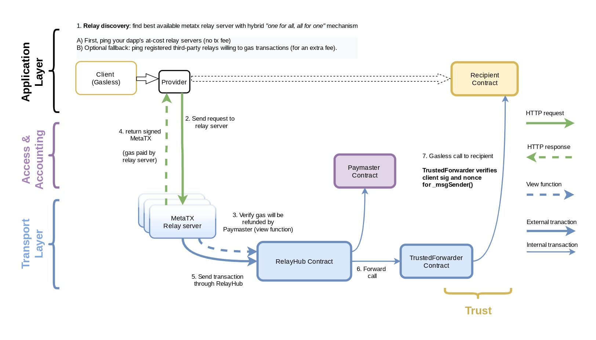

# Gasless Transactions

When you submit a transaction to a blockchain, you need to pay certain fee
(called *gas* in Ethereum jargon). Since only the transactions with the highest
fee will be included in the block, this mechanism effectively prevents denial
of service attacks on the network. On the other hand, paying for the gas
requires the user to have certain amount of blockchain-native tokens available
in their wallet. Such requirement may become a showstopper, if the user doesn't
regularly use or even have access to crypto exchanges since they need to perform
certain KYC and AML procedures apart from requiring from the user to buy actual
tokens. This is especially annoying, if the transaction a user wanted to perform
was not financially-related at all, but their account was used just for
authentication. For example, suppose a user wanted to submit their vote in an
on-chain, decentralized poll. Requiring blockchain-specific tokens in their
account just to pay for a fee reduces their experience.

There are two approaches on how to tackle paying for the gas problem above:

1. You send a small amount of tokens to the accounts of your users so that they
   can pay for the fee when submitting a transaction, or
2. The user signs and sends their transaction to a *relayer* which has enough
   tokens to cover the transaction fees.

A relayer wraps the original, signed transaction into a new *meta-transaction*
(see [ERC-2771] for details). The meta-transaction is then signed by the relayer
which also covers the fees and submits it. The on-chain recipient contract
decodes the meta-transaction, verifies both signatures and executes it.

Oasis Sapphire supports two transaction relaying methods: The on-chain signer
exposes the Oasis-specific contract state encryption functionality while the gas
station network method is a more standard approach known in other blockchains as
well.

:::caution

The Gas Station Network implementation on Sapphire is still in early beta. Some
features such as the browser support are not fully implemented yet.

:::

[ERC-2771]: https://eips.ethereum.org/EIPS/eip-2771

## On-Chain Signer

The on-chain signer stores the private key of the relayer's account inside the
encrypted smart contract state. When the user wants to submit a transaction
without paying for the fee, they perform a signed contract call to the gasless
wrapper and it will generate and return a signed meta-transaction following
[EIP-155]. The user then simply submits the obtained transaction.

In the remainder of the chapter, we explore two gasless methods on the voting
example and answer


Compared to the gas station network method, the meta-transaction generation is
performed on-chain and can be audited and trusted. Also, since the transaction
is submitted by the user and not the trusted relayer, it is censorship
resistant.

TODO: Confidentiality

:::info Example

You can view the source of a complete example in the [demo-voting] repository.
You can also try out a deployed gasless version of the voting dApp on the
[Oasis Playground site][demo-voting-playground]. The ACL is configured so that
anyone can vote on any poll and only poll creators can close the poll.

:::

[demo-voting]: https://github.com/oasisprotocol/demo-voting
[demo-voting-playground]: https://playground.oasis.io/demo-voting
[EIP-155]: https://github.com/ethereum/EIPs/blob/master/EIPS/eip-155.md

## Gas Station Network

[Gas Station Network](https://docs.opengsn.org) (GSN) is very useful for improving
the user experience of many dApps by making their users send transactions
without having native tokens for gas. We make GSN functionalities available on
Sapphire ParaTime.

The diagram below illustrates a flow for signing a transaction by using a Gas
Station Network[^1].



[^1]: The GSN flow diagram is courtesy of [OpenGSN documentation][opengsn-docs].

[opengsn-docs]: https://github.com/opengsn/docs

### Package Install

Starting with an empty folder, let us install the
[Oasis fork of the GSN command line tool](https://github.com/oasislabs/gsn) by
using the following commands:

```shell
pnpm init
pnpm install -D @oasislabs/opengsn-cli
```

Next, we will export our hex-encoded private key (**without** the leading `0x`)
for deploying the gas station network as an environment variable:

```shell
export PRIVATE_KEY=...
```

### Deploy GSN

We will deploy GSN relaying contracts along with the test paymaster using a
test token. Use the address of your account as `--burnAddress` and
`--devAddress` parameters:

```shell
npx gsn deploy --network sapphire_testnet --burnAddress 0xfA3AC9f65C9D75EE3978ab76c6a1105f03156204 --devAddress 0xfA3AC9f65C9D75EE3978ab76c6a1105f03156204 --testToken true --testPaymaster true --yes --privateKeyHex $PRIVATE_KEY
```

After the command finishes successfully, you should find the addreses of
deployed contracts at the end:

```
  Deployed TestRecipient at address 0x594cd6354b23A5200a57355072E2A5B15354ee21
  
  RelayHub: 0xc4423AB6133B06e4e60D594Ac49abE53374124b3 
  RelayRegistrar: 0x196036FBeC1dA841C60145Ce12b0c66078e141E6
  StakeManager: 0x6763c3fede9EBBCFbE4FEe6a4DE6C326ECCdacFc
  Penalizer: 0xA58A0D302e470490c064EEd5f752Df4095d3A002
  Forwarder: 0x59001d07a1Cd4836D22868fcc0dAf3732E93be81
  TestToken (test only): 0x6Ed21672c0c26Daa32943F7b1cA1f1d0ABdbac66
  Paymaster (Default): 0x8C06261f58a024C958d42df89be7195c8690008d
```


### Start GSN Relay Server

Now we are ready to start our own relay server by using the following command.
Use the newly deployed:

- `RelayHub` address for `--relayHubAddress`,
- `TestToken` address for `--managerStakeTokenAddress`,
- address of your account for `--owner-address`

```shell
npx gsn relayer-run --relayHubAddress 0xc4423AB6133B06e4e60D594Ac49abE53374124b3 --managerStakeTokenAddress  0x6Ed21672c0c26Daa32943F7b1cA1f1d0ABdbac66 --ownerAddress '0xfA3AC9f65C9D75EE3978ab76c6a1105f03156204' --ethereumNodeUrl 'https://testnet.sapphire.oasis.dev' --workdir .
```

### Fund and Register GSN Relay Server

The first thing is to fund your relay server so that it has enough native
tokens to pay for others' transactions. Let's fund the paymaster with
**5 tokens**. Use the `RelayHub` and `Paymaster` addresses for `--hub`
and `--paymaster` values:

```shell
npx gsn paymaster-fund --network sapphire_testnet --hub 0xc4423AB6133B06e4e60D594Ac49abE53374124b3 --paymaster 0x8C06261f58a024C958d42df89be7195c8690008d --privateKeyHex $PRIVATE_KEY --amount 5000000000000000000
```

You can check the balance of the paymaster by running:

```shell
npx gsn paymaster-balance --network sapphire_testnet --hub 0xc4423AB6133B06e4e60D594Ac49abE53374124b3  --paymaster 0x8C06261f58a024C958d42df89be7195c8690008d
```

Next, we need to register the relay server with the your desired `relayUrl` by
staking the `token` the relayHub requires.

```shell
npx gsn relayer-register --network sapphire_testnet --relayUrl 'http://localhost:8090' --token 0x6Ed21672c0c26Daa32943F7b1cA1f1d0ABdbac66 --wrap true --privateKeyHex $PRIVATE_KEY
```

After this step, your relay server should be ready to take incoming relay
requests and forward them to the relay hub on Sapphire Testnet.

### Send Testing Relayed Requests:

We can test whether a relayed request can be forwarded and processed correctly.
Scroll up to find the GSN deployment response and use the following parameters:
- `Forwarder` as `--to`,
- `Paymaster` as `--paymaster`,
- your account address as `--from`

Parameters matching our deployment would be:

```shell
npx gsn send-request --network sapphire_testnet --abiFile 'node_modules/@oasislabs/opengsn-cli/dist/compiled/TestRecipient.json' --method emitMessage --methodParams 'hello world!' --to 0x594cd6354b23A5200a57355072E2A5B15354ee21 --paymaster 0x8C06261f58a024C958d42df89be7195c8690008d --privateKeyHex $PRIVATE_KEY --from 0xfA3AC9f65C9D75EE3978ab76c6a1105f03156204 --gasLimit 150000 --gasPrice 100
```

:::info

More detailed explanations of these GSN commands and parameters can be found on
the [upstream OpenGSN website](https://docs.opengsn.org/javascript-client/gsn-helpers.html).

:::

### Writing a GSN-enabled Smart Contract

First, install the OpenGSN contracts package:

```shell
pnpm install -D @opengsn/contracts@3.0.0-beta.2
```

Then follow the remainder of the steps from the
[upstream OpenGSN docs](https://docs.opengsn.org/contracts/#receiving-a-relayed-call).
