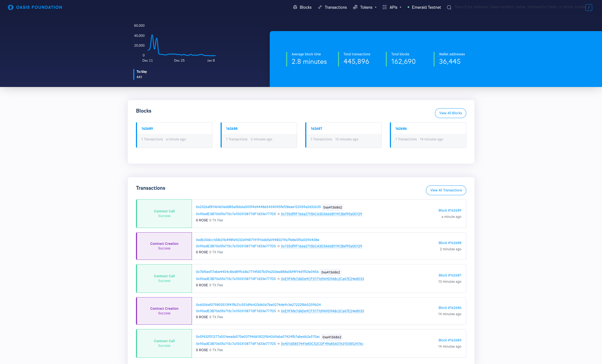
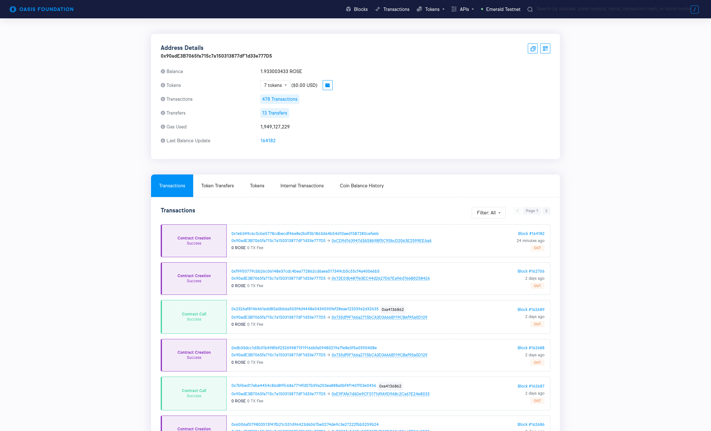
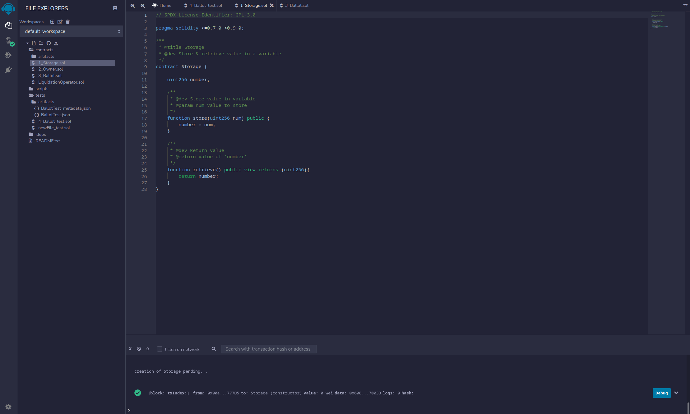
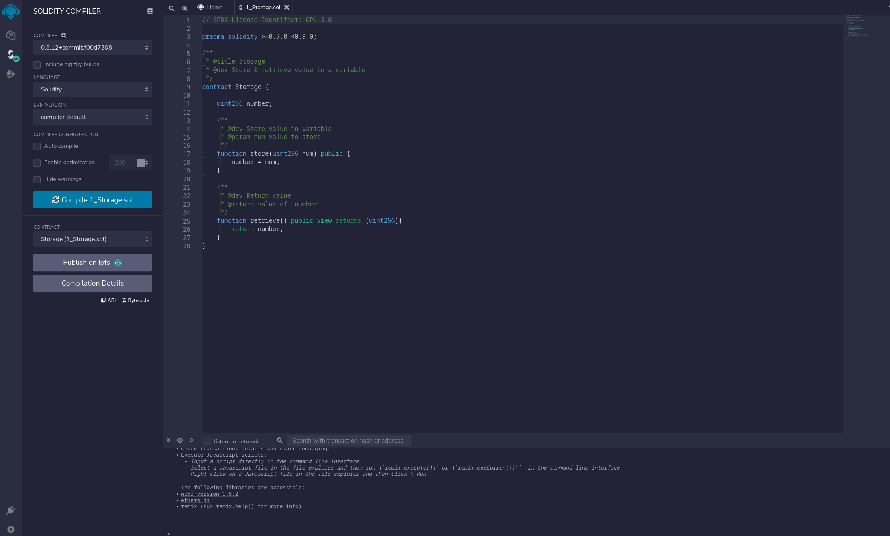
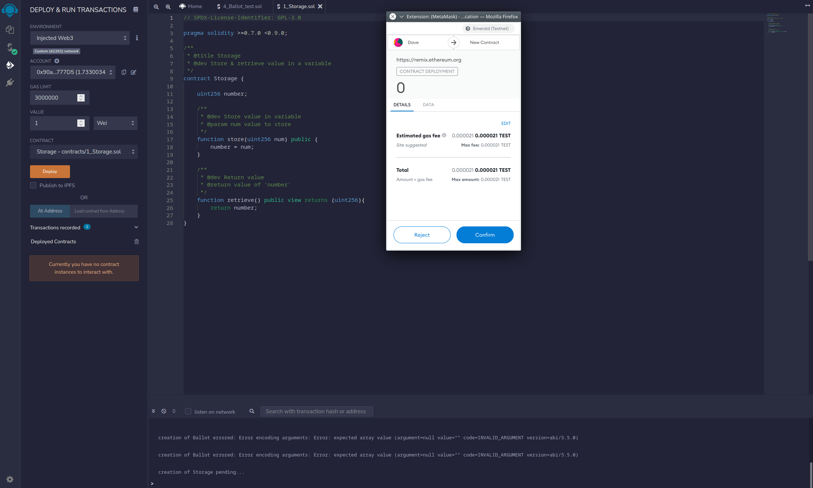
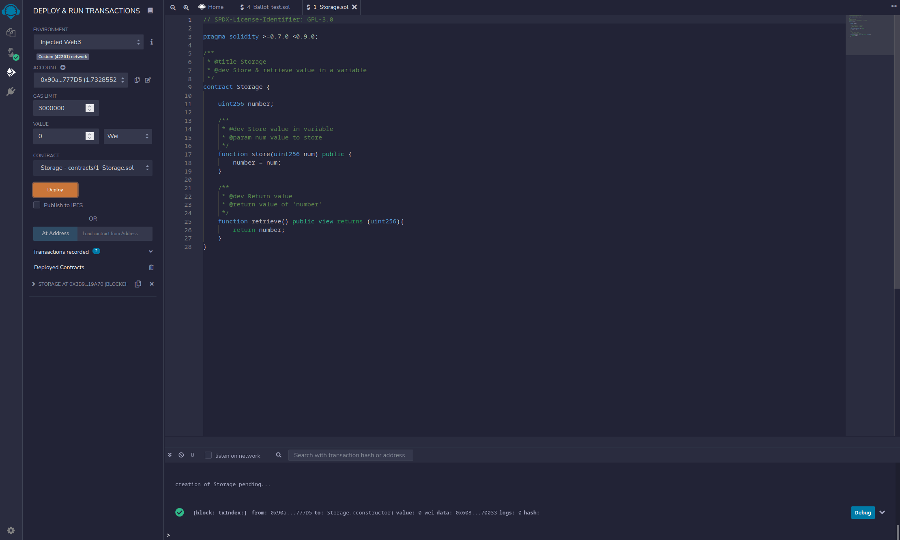
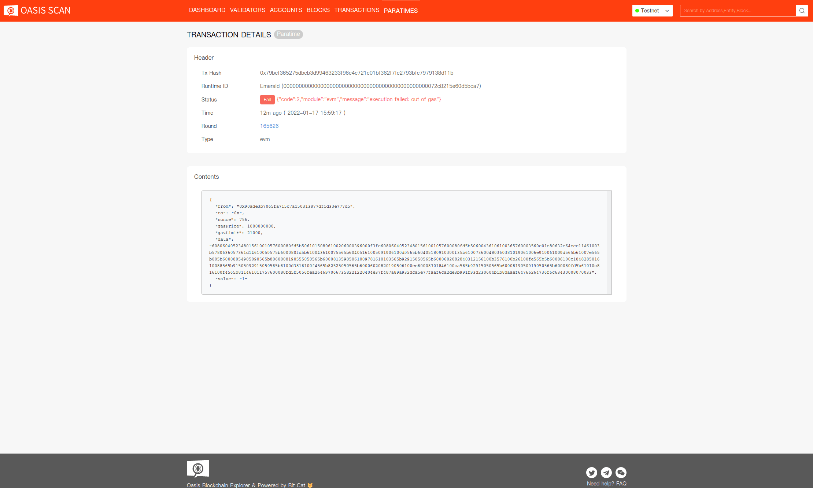

# Writing dapps on Emerald

This tutorial will show you how to set up dapp development environment for
Emerald to be able to write and deploy dapps on Oasis Emerald.

We will walk you through the Hardhat and Truffle configuration and -
for those who prefer a simpler web-only interface - the Remix IDE.
Oasis Emerald exposes an EVM-compatible interface so writing dapps isn't much
different compared to the original Ethereum Network!

## Oasis Consensus Layer and Emerald ParaTime

Oasis Network consists of the Consensus layer and a number of Layer 2 chains
called the ParaTimes (to learn more, check the [Oasis Network Overview]
[overview] chapter). Emerald is a ParaTime which implements the Ethereum
Virtual Machine (EVM).

The minimum and also expected block time in Emerald is **6 seconds**. Any
Emerald transaction will require at least this amount of time to be executed.

The native Oasis addresses are Bech32-encoded (e.g. `oasis1qpupfu7e2n6pkezeaw0yhj8mcem8anj64ytrayne`)
while Emerald supports both the Bech32-encoded and the Ethereum-compatible
hex-encoded addresses (e.g. `0x90adE3B7065fa715c7a150313877dF1d33e777D5`). The
underlying algorithm for signing the transactions is [Ed25519] on the Consensus
layer and both [Ed25519] and [ECDSA] in Emerald. The Ed25519 scheme is used
mostly by the Emerald compute nodes for managing their computation rewards. For
signing your dapp-related transactions on Emerald you will probably want to use
ECDSA since this is the de facto scheme supported by Ethereum wallets and
libraries.

Finally, the ParaTimes are not allowed to directly access your tokens stored in
Consensus layer addresses. You will need to **deposit** tokens from your consensus
account to Emerald. Consult the [How to transfer ROSE into Emerald ParaTime]
[how-to-deposit-rose] chapter to learn more.


[overview]: /general/oasis-network/overview
[Ed25519]: https://en.wikipedia.org/wiki/EdDSA#Ed25519
[ECDSA]: https://en.wikipedia.org/wiki/Elliptic_Curve_Digital_Signature_Algorithm
[how-to-deposit-rose]: /general/manage-tokens/how-to-transfer-rose-into-evm-paratime
[Testnet faucet]: https://faucet.testnet.oasis.dev/

## Testnet and Mainnet

The Oasis Network currently has, similar to some other blockchains, two major
public deployments: the [Mainnet][network-parameters] and the [Testnet]. The
native tokens are called ROSE and TEST respectively. Each deployment has its own
state, a different set of validators and ParaTimes. The state of the Mainnet is
considered immutable for indefinite time, while the data on the Testnet can be
subject to wipe in the future.

The Emerald ParaTime is deployed similarly: the [Emerald Mainnet] is deployed on the Oasis Mainnet
Network while the [Emerald Testnet] on the Oasis Testnet Network. The Emerald state on the Mainnet
is stable. Testnet, apart from running the unstable version of the code and being prone to bugs, can
have the state deliberately wiped either on the Emerald ParaTime layer or on the Oasis Testnet
Network level.

:::danger Never deploy production service on Testnet

Because Testnet state can be wiped in the future, you should **never deploy a
production service on the Testnet**!

:::

:::tip

For testing purposes, visit our [Testnet faucet] to obtain some TEST which you
can then use on the Emerald Testnet to pay for gas fees. The faucet supports
sending TEST both to your Consensus layer address or to your address inside the
ParaTime.

:::

[network-parameters]: /operators/mainnet
[Testnet]: /operators/testnet
[Emerald Mainnet]: ./README.mdx#mainnet
[Emerald Testnet]: ./README.mdx#testnet

## Running Private Oasis Network Locally

For convenient development and testing of your dapps the Oasis team prepared
the [oasisprotocol/emerald-dev][emerald-dev] Docker image which brings you a complete Oasis
stack to your desktop. This network is isolated from the Mainnet or Testnet and
consists of:
- single Oasis validator node with 1-second block time,
- three Oasis compute nodes running Emerald ParaTime,
- Emerald Web3 gateway with transaction indexer,
- helper script which populates initial test accounts for you.

To run the image, execute:

```sh
docker run -it -p8545:8545 -p8546:8546 oasisprotocol/emerald-dev
```

After a while, the tool will show you something like this:

```
emerald-dev 2022-03-11-git38da200 (oasis-core: 22.0, emerald-paratime: 7.1.0-rc1, emerald-web3-gateway: 2.0.0-rc1-git38da200)

Starting oasis-net-runner with Emerald ParaTime...
Starting postgresql...
Starting emerald-web3-gateway...
Populating account(s) (this might take a moment)...

Available Accounts
==================
(0) 0x75eCF0d4496C2f10e4e9aF3D4d174576Ee9010E2 (100 ROSE)
(1) 0x903a7dce5a26a3f4DE2d157606c2191740Bc4BC9 (100 ROSE)
(2) 0xF149ad5CBFfD92ba84F5784106f6Cb071A32a1b8 (100 ROSE)
(3) 0x2315F40C1122400Df55483743B051D2997ef0a62 (100 ROSE)
(4) 0xf6FdcacbA93A428A07d27dacEf1fBF25E2C65B0F (100 ROSE)

Private Keys
==================
(0) 0x160f52faa5c0aecfa26c793424a04d53cbf23dcad5901ce15b50c2e85b9d6ca7
(1) 0x0ba685723b47d8e744b1b70a9bea9d4d968f60205385ae9de99865174c1af110
(2) 0xfa990cf0c22af455d2734c879a2a844ff99bd779b400bb0e2919758d1be284b5
(3) 0x3bf225ef73b1b56b03ceec8bb4dfb4830b662b073b312beb7e7fec3159b1bb4f
(4) 0xad0dd7ceb896fd5f5ddc76d56e54ee6d5c2a3ffeac7714d3ef544d3d6262512c

HD Wallet
==================
Mnemonic:       bench remain brave curve frozen verify dream margin alarm world repair innocent
Base HD Path:   m/44'/60'/0'/0/%d

WARNING: Emerald is running in ephemeral mode. The chain state will be lost after you quit!

Listening on http://localhost:8545 and ws://localhost:8546
```

Those familiar with local dapp environments will find the output above similar
to `geth --dev` or `ganache-cli` commands or the `geth-dev-assistant` npm
package. [emerald-dev] will spin up a private Oasis Network locally, generate
and populate test accounts and make the following Web3 endpoints available for
you to use:
- `http://localhost:8545`
- `ws://localhost:8546`

:::tip

If you prefer using the same mnemonics each time (e.g. for testing purposes)
or to populate just a single wallet, use `-to` flag and pass the mnemonics or
the wallet address. For example

```sh
docker run -it -p8545:8545 -p8546:8546 oasisprotocol/emerald-dev -to "bench remain brave curve frozen verify dream margin alarm world repair innocent"
docker run -it -p8545:8545 -p8546:8546 oasisprotocol/emerald-dev -to "0x75eCF0d4496C2f10e4e9aF3D4d174576Ee9010E2"
```

:::

:::danger

[emerald-dev] runs in ephemeral mode. Any smart contract and wallet balance
will be lost after you quit the Docker container!

:::

[emerald-dev]: https://hub.docker.com/r/oasisprotocol/emerald-dev

## Create dapp on Emerald with Hardhat

Let's begin writing our dapp with Hardhat. We will lay out a base for a modern
dapp including TypeScript bindings for tests and later for the frontend
application.

First, make sure you installed [Node.js] and that you have `npm` and `npx`
readily available. Then run:

```
npx hardhat init
```

Select the `Create an advanced sample project that uses TypeScript` option and
enter the root directory for your project. You can leave other options as
default. After a while Hardhat will finish downloading the dependencies and
create a simple greeter dapp.

To compile, deploy and test the smart contract of your sample project locally,
move to your project directory and type:

```
$ npx hardhat compile
Compiling 2 files with 0.8.4
Generating typings for: 2 artifacts in dir: typechain for target: ethers-v5
Successfully generated 5 typings!
Compilation finished successfully

$ npx hardhat test
No need to generate any newer typings.


  Greeter
Deploying an Emerald Greeter with greeting: Hello, world!
Changing greeting from 'Hello, world!' to 'Hola, mundo!'
    ✓ Should return the new greeting once it's changed (613ms)


  1 passing (614ms)
```

Hardhat already comes with a built-in EVM which is spun up from scratch each
time we call `hardhat test` without parameters. It populates 20 accounts with
ETH and registers them to the [ethers.js] instance used in the tests.

Next, let's look at how to configure Hardhat for Emerald. For convenience, we
assign the `PRIVATE_KEY` environment variable a hex-encoded private key of your
Emerald wallet containing tokens to pay for gas fees. If you are running
[emerald-dev], use any of the five generated private keys.

```
export PRIVATE_KEY="YOUR_0x_EMERALD_PRIVATE_KEY"
```

Next, we configure three networks: `emerald_local`, `emerald_testnet`, and
`emerald_mainnet`. Open `hardhat.config.ts` and replace the `networks` field to
match the following:

```
networks: {
    emerald_local: {
      url: "http://localhost:8545",
      accounts:
        process.env.PRIVATE_KEY !== undefined ? [process.env.PRIVATE_KEY] : [],
    },
    emerald_testnet: {
      url: "https://testnet.emerald.oasis.dev",
      accounts:
        process.env.PRIVATE_KEY !== undefined ? [process.env.PRIVATE_KEY] : [],
    },
    emerald_mainnet: {
      url: "https://emerald.oasis.dev",
      accounts:
        process.env.PRIVATE_KEY !== undefined ? [process.env.PRIVATE_KEY] : [],
    },
  },
```

Next, we increase the default timeout for mocha tests from 20 seconds to 60
seconds. This step is not needed, if you will test your contracts solely on
[emerald-dev], but is required for Testnet to avoid timeouts. Append the
following block to the `config` object:

```
mocha: {
  timeout: 60000
}
```

:::info

`geth --dev` and `ganache-cli` tools use a so-called "instant mining" mode.
In this mode, a new block is mined immediately when a new transaction occurs in
the mempool. Neither Oasis Mainnet and Testnet Networks nor [emerald-dev]
support such mode and the new block will always be mined at least after the 1
second block time elapsed.

:::

Now deploy the contract to the local [emerald-dev] Docker container by
selecting the `emerald_local` network we configured above and run the tests:

```
$ npx hardhat run scripts/deploy.ts --network emerald_local
No need to generate any newer typings.
Greeter deployed to: 0x4e1de2f6cf4e57a8f55b4a5dd1fce770db734962

$ npx hardhat test --network emerald_local
No need to generate any newer typings.


  Greeter
    ✓ Should return the new greeting once it's changed (6017ms)


  1 passing (6s)
```

Next, you can try deploying the contract to the Testnet. Temporarily replace
your `PRIVATE_KEY` environment variable with your Testnet one and deploy the
contract by using the `emerald_testnet` network. Similarly, you can also
run the tests.

```
$ PRIVATE_KEY="0xYOUR_TESTNET_PRIVATE_KEY" npx hardhat run scripts/deploy.ts --network emerald_testnet
No need to generate any newer typings.
Greeter deployed to: 0x735df9F166a2715bCA3D3A66B119CBef95a0D129

$ PRIVATE_KEY="0xYOUR_TESTNET_PRIVATE_KEY" npx hardhat test --network emerald_testnet
No need to generate any newer typings.


  Greeter
    ✓ Should return the new greeting once it's changed (21016ms)


  1 passing (6s)
```

Congratulations, you have just deployed your first smart contract to the public
Emerald Testnet Network! If you are unsure, whether your contract was
successfully deployed, you can monitor the transactions on the Emerald block
explorer ([Mainnet][mainnet-explorer], [Testnet][testnet-explorer]). This tool
indexes all Emerald accounts, blocks, transactions and even offers a neat user
interface for browsing ETH-specifics like the ERC20 tokens and the ERC721 NFTs.





Finally, by selecting the `emerald_mainnet` network and the corresponding
private key, we can deploy the contract on the Mainnet:

```
$ PRIVATE_KEY="0xYOUR_MAINNET_PRIVATE_KEY" npx hardhat run scripts/deploy.ts --network emerald_mainnet
No need to generate any newer typings.
Greeter deployed to: 0x6e8e9e0DBCa4EF4a65eBCBe4032e7C2a6fb7C623
```

[Node.js]: https://nodejs.org
[ethers.js]: https://docs.ethers.io/v5/

## Create dapp on Emerald with Truffle

Truffle and its accompanying [web3.js] library is another popular smart
contract deployment tool. Let's follow [the official Truffle's quickstart
guide][truffle-quickstart] and unbox the MetaCoin example:

```
$ mkdir MetaCoin
$ cd MetaCoin
$ npx truffle unbox metacoin

Starting unbox...
=================

✔ Preparing to download box
✔ Downloading
✔ Cleaning up temporary files
✔ Setting up box

Unbox successful, sweet!

Commands:

  Compile contracts: truffle compile
  Migrate contracts: truffle migrate
  Test contracts:    truffle test
```

To compile and test the contract type:

```
$ npx truffle test
Using network 'test'.


Compiling your contracts...
===========================
> Compiling ./test/TestMetaCoin.sol
> Artifacts written to /tmp/test--1052348-l4q3zOSy9nRA
> Compiled successfully using:
   - solc: 0.5.16+commit.9c3226ce.Emscripten.clang


  TestMetaCoin
    ✓ testInitialBalanceUsingDeployedContract (112ms)
    ✓ testInitialBalanceWithNewMetaCoin (106ms)

  Contract: MetaCoin
    ✓ should put 10000 MetaCoin in the first account (59ms)
    ✓ should call a function that depends on a linked library (78ms)
    ✓ should send coin correctly (185ms)


  5 passing (6s)
```

This spawns an instance of Truffle Develop blockchain in the background with a
number of prepopulated ETH accounts and runs the tests.

Now, let's add support to Truffle for reading the private key stored in the
environment variable. Add the `@truffle/hdwallet-provider` package:

```
$ npm i @truffle/hdwallet-provider --save-dev
```

Import the library by adding the following line at the beginning of your
`truffle-config.js`:

`const HDWalletProvider = require("@truffle/hdwallet-provider");`

Open `truffle-config.js` and configure the `emerald_local`, `emerald_testnet`
and `emerald_mainnet` networks:

```
emerald_local: {
  url: "http://localhost:8545",
  provider: function() {
    return new HDWalletProvider(process.env.PRIVATE_KEYS.split(","), "http://localhost:8545");
  },
  network_id: "*"
},
emerald_testnet: {
  url: "https://testnet.emerald.oasis.dev:8545",
  provider: function() {
    return new HDWalletProvider(process.env.PRIVATE_KEY, "https://testnet.emerald.oasis.dev");
  },
  network_id: "*"
},
emerald_mainnet: {
  url: "https://emerald.oasis.dev:8545",
  provider: function() {
    return new HDWalletProvider(process.env.PRIVATE_KEY, "https://emerald.oasis.dev");
  },
  network_id: "*"
}
```

The MetaCoin example is somewhat specific in that it expects at least two
private keys for running the token transfer test. That's why we use the
`.split(",")` in the `emerald_local` network configuration above and we assign
two private keys to the environment variable. If you are running [emerald-dev],
copy and paste any two of the generated private keys.

```
export PRIVATE_KEYS="0xYOUR_FIRST_EMERALD_PRIVATE_KEY,0xYOUR_SECOND_EMERALD_PRIVATE_KEY"
```

When we run the tests Truffle will deploy the contract with its dependencies
and call the contract numerous times so it may take a few moments to complete.

```
$ truffle test --network emerald_local
Using network 'emerald_local'.


Compiling your contracts...
===========================
> Compiling ./test/TestMetaCoin.sol
> Artifacts written to /tmp/test--1083354-x87wt3FdmfDE
> Compiled successfully using:
   - solc: 0.5.16+commit.9c3226ce.Emscripten.clang


  TestMetaCoin
    ✓ testInitialBalanceUsingDeployedContract (1091ms)
    ✓ testInitialBalanceWithNewMetaCoin (913ms)

  Contract: MetaCoin
    ✓ should put 10000 MetaCoin in the first account (349ms)
    ✓ should call a function that depends on a linked library (677ms)
account one: 0x90adE3B7065fa715c7a150313877dF1d33e777D5
account two: 0x33a8Ba274FEdFeed6A08d09eC524a1E1A6Da8262
    ✓ should send coin correctly (2795ms)


  5 passing (26s)
```

In order to deploy the contracts to the Testnet and finally the Mainnet run the
`migrate` Truffle command and use the `emerald_testnet` or `emerald_mainnet`
network accordingly. For the Mainnet, you would run something like this and in
a few rounds - depending on the network congestion - the contracts will be
deployed:

```
$ PRIVATE_KEY=0xYOUR_MAINNET_PRIVATE_KEY truffle migrate --network emerald_mainnet

Compiling your contracts...
===========================
> Everything is up to date, there is nothing to compile.


Starting migrations...
======================
> Network name:    'emerald_mainnet'
> Network id:      42262
> Block gas limit: 21000000 (0x1406f40)


1_initial_migration.js
======================

   Deploying 'Migrations'
   ----------------------
   > transaction hash:    0x1630945ac8abfe6395a2e2627bd0acfffcf4bda9e107943cb3e4d6ef1d0905d4
   > Blocks: 1            Seconds: 44
   > contract address:    0xFaeA7eda8Be7AC83f811019094D0065D28F52c7c
   > block number:        93914
   > block timestamp:     1642176860
   > account:             0x90adE3B7065fa715c7a150313877dF1d33e777D5
   > balance:             0
   > gas used:            209087 (0x330bf)
   > gas price:           0 gwei
   > value sent:          0 ETH
   > total cost:          0 ETH


   > Saving migration to chain.
   > Saving artifacts
   -------------------------------------
   > Total cost:                   0 ETH


2_deploy_contracts.js
=====================

   Deploying 'ConvertLib'
   ----------------------
   > transaction hash:    0xf2c53938773c316051f4ce98395e5df21cfcf0c686f634c1079725e04b9c556c
   > Blocks: 2            Seconds: 80
   > contract address:    0xA0FB05d6Ce497beb162C4EbA4F203544B18A3f31
   > block number:        93918
   > block timestamp:     1642177009
   > account:             0x90adE3B7065fa715c7a150313877dF1d33e777D5
   > balance:             0
   > gas used:            121235 (0x1d993)
   > gas price:           0 gwei
   > value sent:          0 ETH
   > total cost:          0 ETH


   Linking
   -------
   * Contract: MetaCoin <--> Library: ConvertLib (at address: 0xA0FB05d6Ce497beb162C4EbA4F203544B18A3f31)

   Deploying 'MetaCoin'
   --------------------
   > transaction hash:    0x2c5e8177df03d643e56a37b64cbe660420b114ffec097dc5d793bfc666af8e16
   > Blocks: 2            Seconds: 60
   > contract address:    0x5a1C04012bc233c898aebb8BB4353F80D96f3dD2
   > block number:        93920
   > block timestamp:     1642177073
   > account:             0x90adE3B7065fa715c7a150313877dF1d33e777D5
   > balance:             0
   > gas used:            361168 (0x582d0)
   > gas price:           0 gwei
   > value sent:          0 ETH
   > total cost:          0 ETH


   > Saving migration to chain.
   > Saving artifacts
   -------------------------------------
   > Total cost:                   0 ETH


Summary
=======
> Total deployments:   3
> Final cost:          0 ETH
```

In the output above, the MetaCoin contract has been successfully deployed to
`0x5a1C04012bc233c898aebb8BB4353F80D96f3dD2` address on the Mainnet.

[web3.js]: https://web3js.readthedocs.io/en/v1.5.2/
[truffle-quickstart]: https://trufflesuite.com/docs/truffle/quickstart.html

## Create dapp on Emerald with Remix - Ethereum IDE

[Remix] is a popular web IDE for swift development, deployment and testing
smart contracts on the Ethereum Network. We will use it in combination with
MetaMask to access the network settings and your wallet to sign and submit the
transactions.

If you haven't done it yet, first [install the MetaMask extension for your
browser][metamask]. Import your wallet and configure Emerald Testnet and
Mainnet Networks. If you wish to connect to [emerald-dev] container, configure
the local network as well.

When you open Remix for the first time, it automatically creates an example
project. Let's open one of the contracts and compile it in the "Solidity
compiler" tab.





Next, in the "Deploy and Run Transactions" tab, select the "Injected Web3"
environment. A MetaMask popup will appear and you will have to connect one or
more accounts with Remix. Once the connection succeeds, click on the "Deploy"
button. The MetaMask popup appears again and you will have to review the
transaction, the gas options and finally confirm the transaction.



If everything goes well, your transaction will be deployed using the selected
account in the MetaMask and the corresponding Emerald Network.



:::info

Sometimes the gas limit estimation function might compute a slightly lower
value from the required one. In this case, try increasing the gas limit
manually by 10% or 20%.

:::

Congratulations! Now you can start developing your own smart contracts on the
Oasis Emerald blockchain! Should you have any questions, do not hesitate to
share them with us on the [#emerald-paratime Discord channel][discord].

[Remix]: https://remix.ethereum.org
[metamask]: /general/manage-tokens/how-to-transfer-rose-into-evm-paratime#verifying-rose-balance-on-emerald-paratime
[discord]: https://discord.gg/pJdWeVtmHT

## Troubleshooting

### Deployment of my contract timed out on Testnet or Mainnet

Emerald validators, similar to Ethereum ones, order the execution of
transactions by gas price. When deploying a contract and the deployment times
out, first wait another few rounds to make sure that the contract will not be
deployed eventually.

Next, check that your `gasPrice` **is at least 10 nROSE** which is a minimum
required gas price on Emerald. This value should already be propagated
automatically by the web3 endpoint, but your deployment configuration might
have ignored it.

Finally, consider increasing the `gasPrice` parameter in Hardhat/Truffle config
files by a fraction (e.g. 10% or 20%). This will require more ROSE from your
wallet to deploy the contract, but you will also increase the chance of your
transaction being included in the block.

### Execution of my contract failed. How do I debug what went wrong?

If you are using Testnet or Mainnet, try to debug your transaction by finding
it on the Emerald block explorer ([Mainnet][mainnet-explorer], [Testnet][testnet-explorer]):


In some cases, the transaction result on Emerald block explorer might be stuck
at `Error: (Awaiting internal transactions for reason)`. In this case or in
case of other Consensus layer ↔ ParaTime issues, try to find your Emerald
transaction on the Oasis Scan ([Mainnet][mainnet-oasisscan], [Testnet]
[testnet-oasisscan]) which is primarily a Consensus layer explorer, but offers
some introspection into ParaTime transactions as well. Once you find your
failed Emerald transaction, the `Status` field should contain a more verbose
error description, for example:



[mainnet-explorer]: https://explorer.emerald.oasis.dev
[testnet-explorer]: https://testnet.explorer.emerald.oasis.dev
[mainnet-oasisscan]: https://oasisscan.com
[testnet-oasisscan]: https://testnet.oasisscan.com
