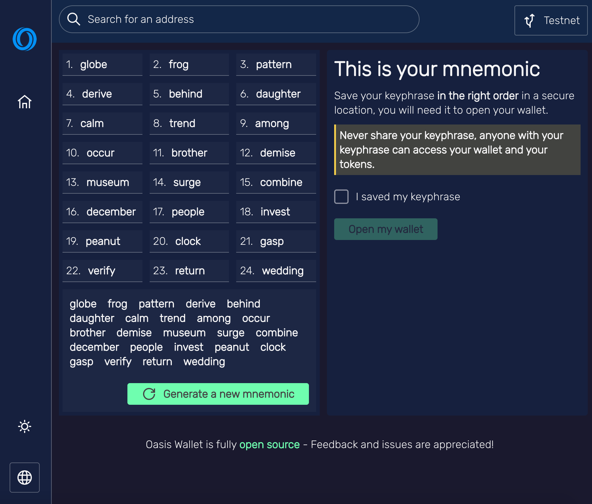
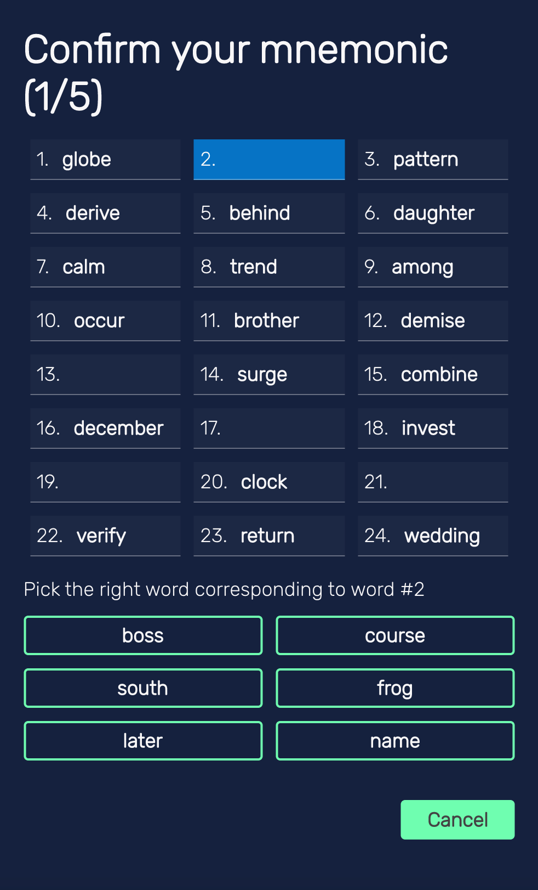
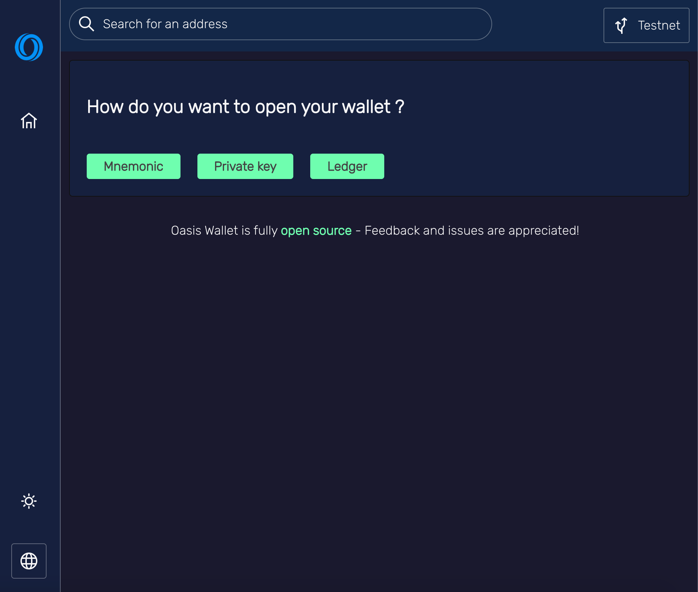
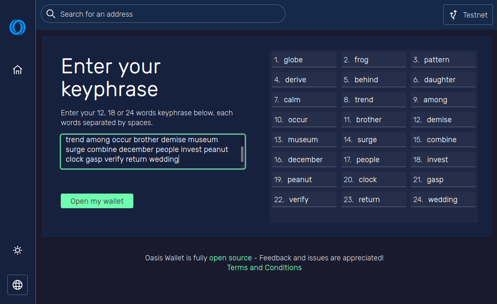
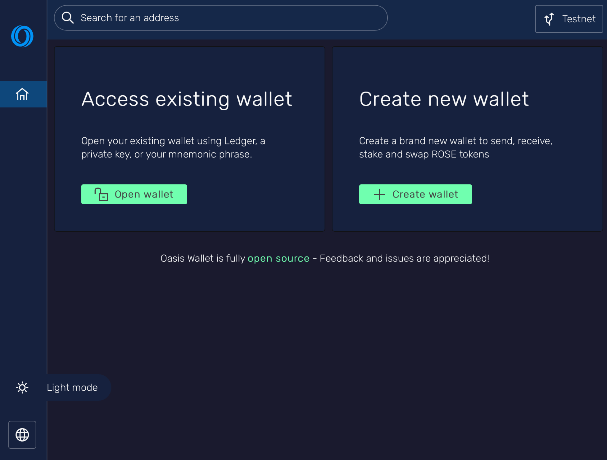
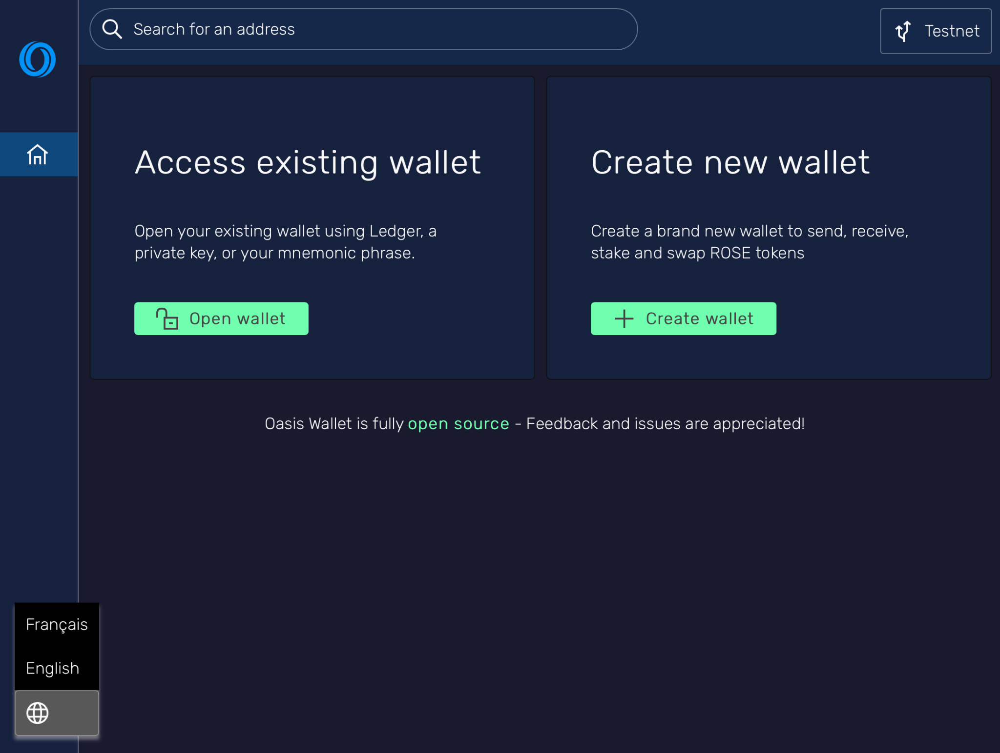

# Web

## How to use the Oasis Wallet - Web

### **Access the Oasis Wallet via your web browser**

You can access the [Oasis Wallet - Web](https://github.com/oasisprotocol/oasis-wallet-web/) by heading to [https://wallet.oasisprotocol.org](https://wallet.oasisprotocol.org). For the best performance, we recommend using [Chrome](https://www.google.com/chrome/) or any other [Chromium](https://www.chromium.org/Home)-based browser.

### **Create a New Wallet**

If you do not currently have an existing Oasis wallet address, you can create a new wallet address directly from the Oasis Wallet's home screen. Click on the “Create wallet” button.

The next page contains information about your mnemonic (an ordered list of words representing your keyphrase), which you will need in order to retrieve your wallet later. Review the information on this page very carefully. Save your mnemonic in the right order in a secure location.

:::caution

Your mnemonic (i.e. keyphrase) is required to access your wallet. Be sure to store it in a secure location. If you lose or forget your mnemonic, you will lose access to your wallet and any token funds contained in it.

:::

:::caution

Never share your mnemonic (i.e. keyphrase). Anyone with your mnemonic can access your wallet and your tokens.

:::

After you’ve saved your mnemonic, click the “I saved my keyphrase” checkbox and then click on the “Open my wallet” button.

Next, you will need to confirm your mnemonic by filling in some missing words. You can enter the missing word for each respective box, by clicking on the appropriate word from the list of words presented below. Be sure to enter all of the missing words in the right order.

After you correctly enter all of the missing words, you will be taken to your Oasis Wallet home screen, containing information about your account balance and more.

### **Access an Existing Wallet**

If you already have an existing Oasis wallet address, you can open it in the web wallet by clicking the “Open wallet” button on the home screen.

Next, you should select whether you want to open your wallet via a mnemonic, a private key, or a Ledger hardware wallet. Select the respective button corresponding to the retrieval method you want to use.

#### Open Wallet via Mnemonic

In the _Enter your keyphrase_ field, enter each word of your mnemonic separated by a space. Afterwards, hit the "Open my wallet" button.

:::info

Oasis Wallet - Web uses English mnemonic phrase words as defined in [BIP39](https://github.com/bitcoin/bips/blob/master/bip-0039.mediawiki). You can find a complete list of all valid phrase words [here](https://github.com/bitcoin/bips/blob/master/bip-0039/english.txt). If you misspelled a word, the wallet will warn you.

:::

:::caution

Oasis Wallet mnemonics are incompatible with BitPie mnemonics. Check our [FAQ](./README.mdx#frequently-asked-questions) for more information.

:::

#### Open Wallet via Private Key

Paste your Base64-encoded Ed25519 private key in the _Enter your private key_ field and then click on the "Open my wallet" button.

:::info

The Ed25519 private key format that is used is 64 bytes long and consists of two 32-byte parts:

1. First 32 bytes are the **private key seed** which is used to derive the private key that is then used for signing the transactions (i.e. sending tokens from your wallet).
2. Last 32 bytes are the **public key** which is used to compute your account's address of the form `oasis1...`.

:::

:::danger

If you typed in the private key manually, make sure you do not mix similar characters like the big O and 0 or big I and 1!

Currently, there is no error detection on the inputted private key, so the wallet cannot warn you of a mistyped character. **It is imperative that you correctly input the private key, otherwise you will not be able to access your funds!**

We suggest that you perform a test transaction the first time you import your wallet from the private key so you can rest assured the key is valid.

:::

#### Open wallet with Ledger

To open your wallet via a Ledger hardware wallet, make sure you have your Ledger device readily available and have familiarized yourself with the [Oasis-specific Ledger usage instructions](../holding-rose-tokens/ledger-wallet.md).

Follow the instructions on the screens that follow to open your existing wallet address.

:::caution

To date, only Chromium-based browsers support WebUSB component which is required to access your Ledger device.

:::

After you complete the instructions, you will be taken to your Oasis Wallet home screen, containing information about your account balance and more.

### **Toggle between light mode and dark mode**

If you are in night mode, you can click on the sun icon near the lower left corner of the screen to switch to light mode.

If you are in light mode, you can click on the moon icon near the lower left corner of the screen to switch to dark mode.

### **Select a language for the web wallet interface**

To select a language, you can click the globe icon near the lower left corner of the screen. Currently, you can select either English or French.

## **Share your feedback with us**

If you have any questions or issues using the [Oasis Wallet - Web](https://github.com/oasisprotocol/oasis-wallet-web/), you can [submit a Github issue](https://github.com/oasisprotocol/oasis-wallet-web/issues) and the dev team will take a look. You can also connect with us to share your feedback via [Discord](https://discord.gg/RwNTK8t) or [Telegram](https://t.me/oasisprotocolcommunity).
