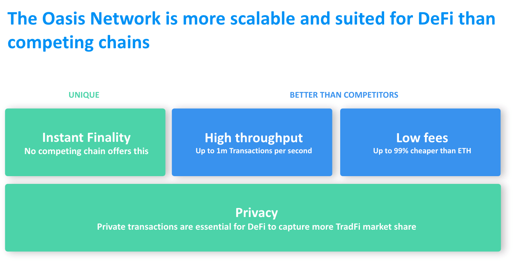
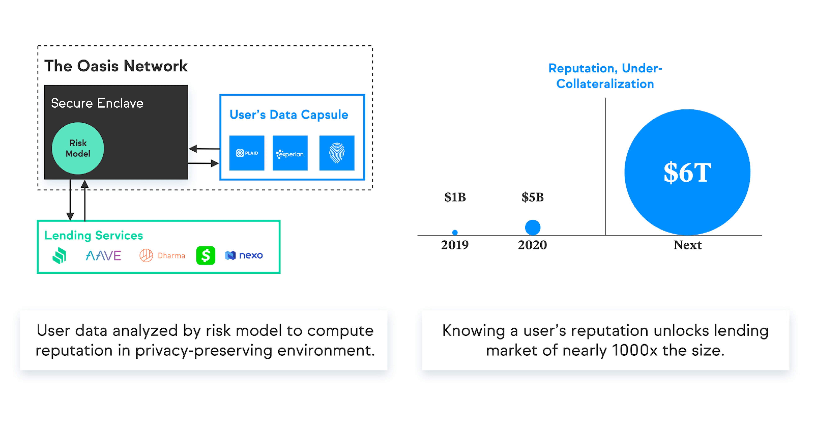
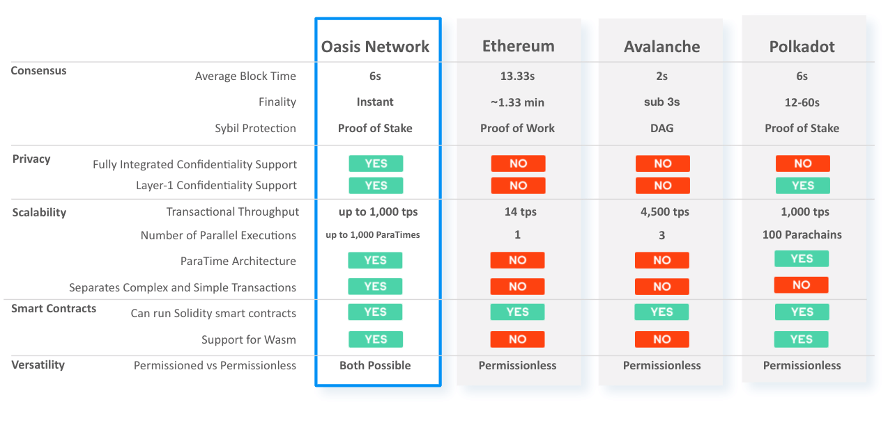
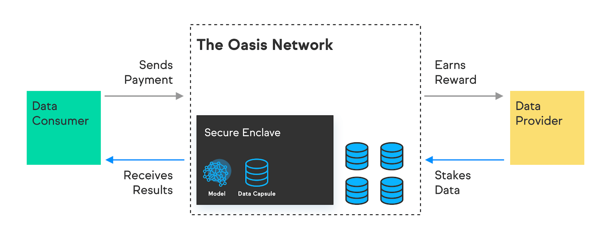
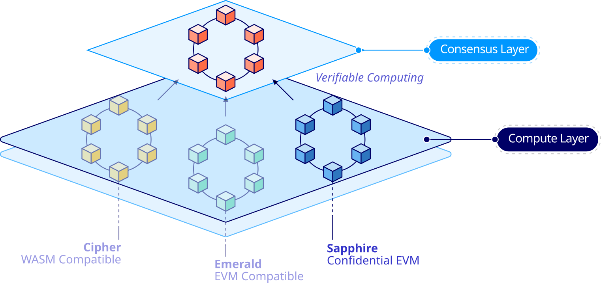
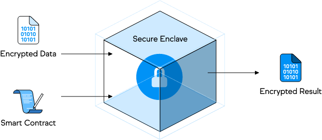
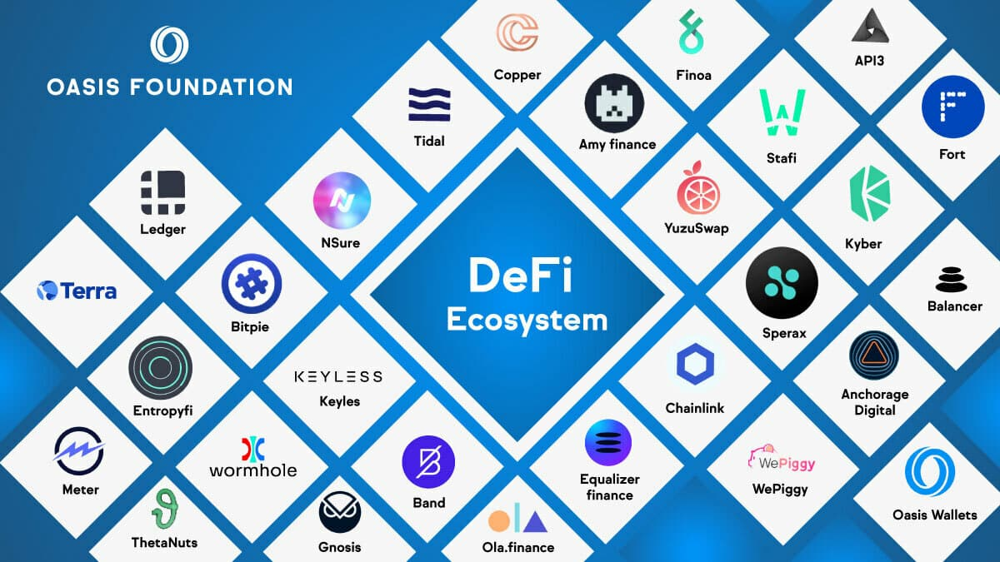
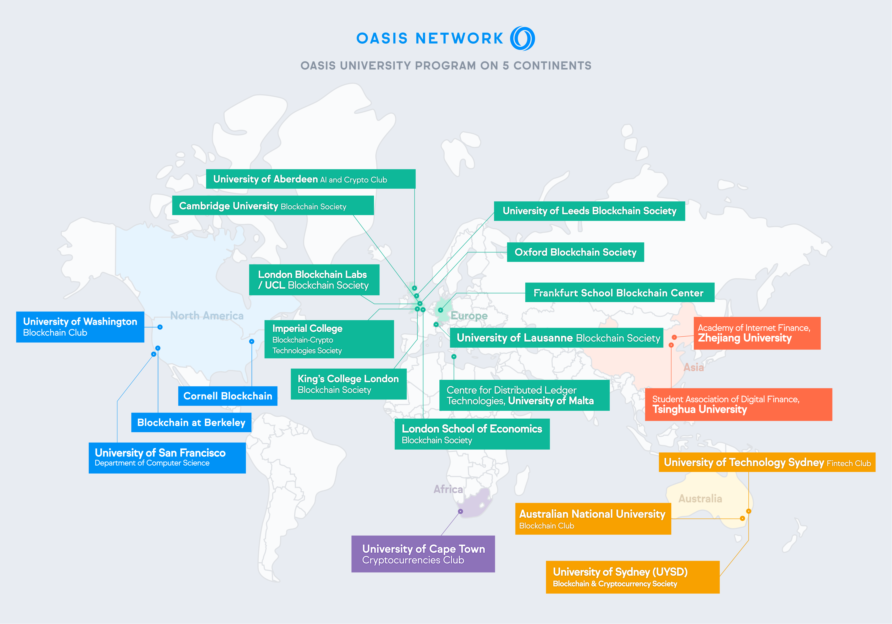

# Why Oasis?

## Network Overview

Designed for the next generation of blockchain, the Oasis Network is the first privacy-enabled blockchain platform built to scale for open finance, a responsible data economy, and web 3. Combined with its high throughput and secure architecture, the Oasis Network will power private, scalable DeFi, revolutionizing Open Finance and expanding it beyond traders and early adopters to a mass market. Its unique privacy features will not only redefine DeFi and Web 3 but also create a new type of digital asset called Tokenized Data. This will enable users to take control of the data they generate and earn rewards for staking it with applications, creating the first-ever responsible data economy.

### Why the Oasis Network?

**Privacy-Enabled Blockchain:** The Oasis Network is the world’s leading scalable, privacy-enabled blockchain. ParaTimes on the Oasis Network can leverage privacy-preserving technology enabling users to share their data to earn income while keeping it totally confidential, unlocking new Web 3 use cases like digital identity and private metaverse applications for blockchain.

**Scalable, Private DeFi:** The DeFi market is still in its infancy, with trillions of dollars in existing financial markets ready to enter the space. The expansion of DeFi is limited by a lack of privacy, security as well as high fees. The result is an overloaded and expensive system that’s impossible to scale. Oasis Network is a Layer 1 blockchain that can expand DeFi beyond early adopters into mass-market adoption.

**Enables Data Tokenization:** The Oasis Network can Tokenize Data. This will unlock game-changing use cases for blockchain, and an entirely new ecosystem of apps and projects on the network, powering the next generation of privacy-first applications that reward users for the value they create.

**Rapidly Growing Community:** The Oasis Network has a thriving community of node operators, developers, enterprise partners, ambassadors, and community members engaged in global social channels.

**Top-Tier Team:** The Oasis Team is made up of top talent, from around the world, with backgrounds from Apple, Google, Amazon, Goldman Sachs, UC Berkeley, Carnegie Mellon, Stanford, Harvard, and more. All the core engineering team are PHD level educated and all committed to growing and expanding the impact of the Oasis Network.

### Technology Highlights

* **Separates consensus and execution into two layers**, the Consensus Layer and The ParaTime Layer, for better scalability and increased versatility.
* Separation of consensus and execution allows **multiple ParaTimes to process transactions in parallel**, meaning complex workloads processed on one ParaTime won’t slow down faster, simpler transactions on another.
* **The ParaTime Layer is entirely decentralized, allowing anyone to develop and build their own ParaTime.** Each ParaTime can be developed in isolation to meet the needs of a specific application, such as confidential compute, open or closed committees, and more.
* The network’s sophisticated discrepancy detection makes **Oasis more efficient than sharding and parachains**, requiring a smaller replication factor for the same level of security.
* **The network has broad support for confidential computing technology.** The Oasis Eth/WASI Runtime is an open-source example of a confidential ParaTime that uses secure enclaves to keep data private while being processed.
* **There are 3 ParaTimes built by the Oasis core team already on the network.**
  * **Emerald ParaTime, the EVM Compatible ParaTime**, was built to solve the problems faced by Solidity developers. High fees and low throughput. Emerald solves both of these problems by increasing the throughput of transactions to 1,000 per second and reducing fees by 99%+ compared to Ethereum. This means more users will be able to use and build on the network.
  * **Cipher ParaTime, the confidential smart contract ParaTime**, will hold the features that Oasis is known for - privacy-preserving smart contracts. As with Emerald, it boasts high throughput, instant finality, and low fees with added privacy-preserving features. Cipher enables DEX’s to stop front-running transactions, NFT users to protect their assets privately, and can potentially unlock trillions in credit and lending markets from traditional finance.
  * **Parcel ParaTime, the confidential data storage, governance, and compute ParaTime,** Parcel already has enterprise partners like Nebula Genomics, Genetica, and BMW, using it to store private data like human genomic data. Parcel enables governance, confidential computation, and private analysis of data. Applications developers can use the Parcel SDK to integrate privacy-preserving data storage, governance, and computation into their applications. Parcel is also the data tokenization engine that can turn any data file into an NFT. We envisage this functionality to enable people to take back control of the data they create, turning it into assets they can stake and earn rewards, thus creating a new responsible data economy.

## New Application Domains

### Scalable, Private DeFi

The DeFi market is still in its infancy, with trillions of dollars in existing financial markets ready to enter the space. The expansion of DeFi is limited by a lack of privacy, security, and high fees. The result is an overloaded and expensive system that’s impossible to scale.

The Oasis Network is ideal for DeFi applications due to its scalability, instant finality, 99% lower gas fees versus Ethereum, and high throughput.

The Oasis Network is designed to support confidential smart contracts that keep data private while being processed. By providing end-to-end data confidentiality on Blockchain, the Oasis Network unlocks new and exciting use cases in DeFi. From under-collateralized lending to preventing front/back running, the Oasis Network can help expand DeFi beyond traders and early adopters to a mainstream market.

The network’s cutting-edge scalability features can help unblock DeFi as it works today, fixing the high-transaction fees and slow throughput currently plaguing other Layer 1 networks. Combined, Oasis’ unique ability to provide scalable, private DeFi is expected to make it the leading platform for unlocking the next generation of DeFi markets and use cases.

### Data Tokenization & A Responsible Data Economy

The Oasis Network’s combination of confidential computing and blockchain enables a new paradigm called Tokenized Data. Blockchain allows for logging and enforcement of usage policies with high integrity and ‘auditability’. Confidential computing ensures that data remains private during computation and cannot be reused without permission. This capsule of data + policies creates a new kind of digital asset that can be consumed, along with specific guidelines for a fee or exchange of value.

With Tokenized Data, the Oasis Network can power the next generation of privacy-first applications and unlock a new responsible data society. Data providers on the Oasis Network can put their Tokenized Data to use. They can earn rewards by staking their data with apps that want to analyze it or control how their most sensitive information is consumed by the services they use.

Many projects have already begun building apps that leverage data tokenization on the Oasis. Here are just a few examples:

:::tip Case Study: Binance CryptoSafe Alliance

Crypto theft and attacks are on the rise, and exchanges need a platform to identify and ban bad actors. The CryptoSafe Platform was developed by Oasis Labs and Binance to allow exchanges to share threat intelligence data. Because of the Oasis Network’s support for confidential compute, exchange data is kept confidential even while it's being compared.

:::

:::tip Case Study: Fortune 500 Healthcare Provider

A Fortune 500 healthcare provider wanted to share data with external parties while retaining control of the data and protecting the confidentiality of patient data. Using an Oasis Labs-built API this leading healthcare company is able to track, trace, and control data usage even when shared with 3rd parties.

:::

:::tip Case Study: Nebula Genomics

Nebula Genomics wants to differentiate their product from other competitors by giving their users control of their genetic data. Using Oasis’ framework, customers can retain ownership of their genomic data and Nebula Genomics can run analysis on the data without seeing the customer’s raw information.

:::

## Technology Overview

The Oasis Network is a Layer 1, proof-of-stake, decentralized network. It has two main components, the Consensus Layer and the ParaTime Layer.

1. The **Consensus Layer** is a scalable, high-throughput, secure, proof-of-stake consensus run by a decentralized set of validator nodes.
2. The **ParaTime Layer** hosts many parallel runtimes (ParaTimes), each representing a replicated compute environment with shared state.

### Scalability

The Oasis Network’s impressive scalability is achieved through a cutting-edge set of features that provide faster transaction speeds and higher throughput than other networks. The top-tier performance of the network is largely due to its separation of compute and consensus operations into the Consensus Layer and ParaTime Layer. This separation allows multiple ParaTimes to process transactions in parallel, meaning complex workloads processed on one ParaTime won’t slow down faster, simpler transactions on another. Plus, the network’s sophisticated discrepancy detection makes Oasis more efficient than sharding and parachains, requiring a smaller replication factor for the same level of security.

### Privacy-First

The Oasis Network designed Cipher, the first-ever confidential ParaTime with support for confidential smart contracts. In a confidential ParaTime, nodes are required to use a type of secure computing technology called a TEE (Trusted Execution Environment.) TEEs act as a hypothetical black box for smart contract execution in a confidential ParaTime. Encrypted data goes into the black box along with the smart contract, where the data is decrypted, processed by the smart contract, and then encrypted before it is sent out of the TEE. This process ensures that data remains confidential and is never leaked to the node operator or application developer The Oasis Eth/WASI Runtime is an open-source example of a confidential ParaTime that uses Intel SGX. Other secure compute technology can also be used, such as ZKP, HE, or other secure enclaves. In the future, we hope to support additional computation techniques such as secure multi-party compute, federated learning, and more.

Confidentiality unlocks a range of new use cases on blockchain. Personal or sensitive data, such as identity documents, social security numbers, bank statements, financial and credit records, health information, internet usage data, IoT data like fitness records and location data could all be used by apps on the Oasis Network, all the while protecting the user’s privacy. Connecting all these data sources is something even today you wouldn’t even dream of doing, especially not on an existing public Layer 1 blockchain. With Oasis, confidentiality and data tokenization together will give people the ability to securely, privately share their data, turning the data they create every day into income-generating assets.

### Versatility

Designed to support the next generation of blockchain applications, the Oasis Network is incredibly versatile, agile, and customizable. Namely, each ParaTime can be developed in isolation to meet the needs of a specific application. ParaTime committees can be made large or small, open or closed, allowing for faster or more secure execution depending on the requirements of a particular use case. Nodes can be required to have specific hardware, such as Secure Enclaves on a confidential ParaTime. Each ParaTime can similarly run different Runtime VMs (ParaTime Engines), such as EVM backwards compatible engine, Rust-based smart contract language, or a Data tokenization engine. Finally, to support enterprise and developer use cases, ParaTimes can be made Permissioned or Permissionless, allowing consortiums to have their own closed ParaTime, or communities to have full decentralized open ParaTimes.

The versatility of the ParaTime Layer allows the Oasis Network to expand and grow to address a broad set of new and exciting use cases while still maintaining the same core ledger and consensus layer.

## Traction and Adoption

### The Oasis Ecosystem

The Oasis Network has a thriving and rapidly growing ecosystem consisting of industry-leading app developers, blockchain infrastructure teams, node operators, universities, and more. We are proud to highlight some of our key partners and community members in the chart below:

### The DeFi Ecosystem

Emerald, The EVM Compatible Paratime is now live on mainnet, and developers are releasing new projects all the time. Here we highlight some of the recent DeFi projects building on the network:

### The $200m Ecosystem Fund

The Oasis Foundation brought together some of the industry's biggest backers including Binance Labs, Pantera, Dragonfly Capital, Jump Capital, Electric Capital, and more. They all share our vision that privacy is an essential component of successful Web 3 and have pooled together $200m in funding for developers and projects looking to build the next generation of Web 3, DeFi, Metaverse, DAO, and NFT projects on the Oasis Network.

If you want to build on Oasis, you can read more about the Ecosystem Fund [here](https://medium.com/oasis-protocol-project/binance-labs-backs-the-oasis-ecosystem-fund-to-support-the-projects-building-on-oasis-network-f6bcb3be6ee4) or apply to the Ecosystem Fund through this form [here](https://airtable.com/shrSyNBumurHhf7cd).

### Grants & DevAccelerator

The Oasis Foundation has been working with many talented dev teams via our [Grants program](https://oasisprotocol.org/ecosystem-grants) and [DevAccelerator program](https://oasisprotocol.org/dev-accelerator) to build new applications and integrations on top of the Oasis Network. These include:

* [Anthem (by Chorus One)](https://anthem.chorus.one)
* [Alethea.ai](https://medium.com/oasis-protocol-project/devaccelerator-spotlight-alethea-ai-aac8f854e436): A marketplace for AI-generated media
* [Bankex](https://medium.com/oasis-protocol-project/devaccelerator-spotlight-bankex-9bb127f9e449): Send digital assets across your social networks
* [Castalise](https://medium.com/oasis-protocol-project/devaccelerator-spotlight-castalise-347f155ab66f): Enabling privacy-preserving predictive analytics on pharmaceutical data
* [Chainflow Mission Control](https://github.com/Chainflow/oasis-mission-control-grant)
* [Dead Man’s Switch](https://medium.com/oasis-protocol-project/devaccelerator-spotlight-dead-mans-switch-32d07cdfc057): A decentralized, censorship-resistant tool for whistleblowers
* [Luther.ai:](https://luther.ai)  Building artificial intelligence to Retain, Reinforce, Recall and ultimately augment your human memory.
* [Oasis.Fish (by Stakefish)](https://oasis.fish/leaderboard/)
* [Oasis Hubble (by Figment Networks)](https://hubble.figment.network/oasis/chains/amber)
* [Oasis Monitor (by Everstake)](https://oasismonitor.com)
* [Oasisscan (by bitcat)](https://oasisscan.com)
* [Oasis Smartstake (by Smartstake)](https://oasis.smartstake.io): Providing validation services for the Oasis Network
* Oasis Mobile Wallet by RockX
* [Ruyi Health](https://medium.com/oasis-protocol-project/devaccelerator-spotlight-ruyi-health-7c068cfeecea): A Secure, Intuitive, and Intelligent Health Management Solution for Stroke Patients and their providers and insurers.
* [SafeRate](https://medium.com/oasis-protocol-project/devaccelerator-spotlight-saferate-2dbb99c3a43a): Automatically reduce mortgage payments when neighborhoods home values fall
* [SimplyVC Panic Monitoring](https://github.com/SimplyVC/panic_oasis)

### Community Efforts

The Oasis Network has a thriving community with members from around the world. This is driven in part by the Oasis Ambassador program, where volunteers passionate about the Oasis Network run meetups, write and translate content, answer developer questions, manage online communities, stress test the Oasis Network and more.

Ambassadors are also growing strong communities worldwide, including Bangladesh, Vietnam, India, Brazil, Korea, Nigeria, Philippines, Russia, China, South Korea, Turkey, and more.

The Oasis Network also has the **largest University Program of any Layer-1 blockchain** with over 25 top university departments, blockchain clubs, and others across 5 continents. Members of the program run nodes, build apps and more. Participating universities and university student organizations include Blockchain at Berkeley, Tsinghua University’s Student Association of Digital Finance, Cambridge University’s Blockchain Society, and many more.

### Contributing Team

The Oasis Team is made up of world-leading researchers, security experts, and privacy advocates — all working together to build a platform for a responsible data economy.

#### [Oasis Foundation](https://www.linkedin.com/company/oasisprotocol/)

* [See team page on our website](https://oasisprotocol.org/about-us)

#### [Oasis Labs](https://www.linkedin.com/company/oasis-labs)

* [Dawn Song, Founder](https://www.linkedin.com/in/dawn-song-51586033/)
* [Peter Gilbert, Director of Engineering](https://www.linkedin.com/in/peter-gilbert-2b70b1167/)

### Press

Over 200 articles have been written since the company came out of stealth mode. Top articles and interviews include:

* [The New York Times: Building a World Where Data Privacy Exists Online](https://www.nytimes.com/2019/11/19/technology/artificial-intelligence-dawn-song.html)
* [WIRED: Oasis Labs' Dawn Song on a Safer Way to Protect Your Data](https://www.wired.com/story/dawn-song-oasis-labs-data-privacy-wired25/)
* [MIT Technology Review: How AI could save lives without spilling medical secrets](https://www.technologyreview.com/2019/05/14/239125/how-ai-could-save-lives-without-spilling-secrets/)
* [Yahoo! Finance: Web3 Users will Control Their Data, Says Oasis Ecosystem Head](https://www.yahoo.com/now/web3-users-control-data-says-132837055.html)
* [Cointelegraph: First DEX on Oasis Network hits $100M TVL in 24 hours ](https://cointelegraph.com/news/first-dex-on-oasis-network-hits-100m-tvl-in-24-hours)
* [Cointelegraph: Binance Labs backs $200M Oasis Ecosystem Fund ](https://cointelegraph.com/news/binance-labs-backs-200m-oasis-ecosystem-fund)
* [CoinSpeaker: Oasis Protocol Inks Partnership with Meta to Facilitate AI Computing Applications](https://www.coinspeaker.com/oasis-protocol-partnership-meta/)
* [Cointelegraph: AkoinNFT to Sell Historic DNA Data Art as NFT In Collaboration With Oasis Network ](https://cointelegraph.com/news/akon-to-sell-historic-dna-data-art-as-nft-on-oasis-network)
* [Nature: How scientists are embracing NFTs ](https://www.nature.com/articles/d41586-021-01642-3)
* [Cointelegraph: Concerns around data privacy are rising, and blockchain is the solution](https://cointelegraph.com/news/concerns-around-data-privacy-are-rising-and-blockchain-is-the-solution)
* [Coin Desk: The Educator-Entrepreneurs of Crypto](https://www.coindesk.com/business/2021/10/05/the-educator-entrepreneurs-of-crypto/)

Articles about the Oasis Network have focused on a variety of topics and span across both mainstream and crypto press:

